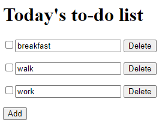

## React application
Let's take the project from the previous [step](../03) and create a simple react application.  
Install the `React` libraries:
```
npm add react react-dom
npm add -D @types/react @types/react-dom
```

Delete js files from the [src](src) folder and create several [tsx files](https://react.dev/learn/typescript).  
Replace the entry point in [webpack.config.ts](webpack.config.ts) with [src/index.tsx](src/index.tsx).  
Set the `jsx` property to `react-jsx` value in the [tsconfig.json](tsconfig.json) file so that we do not need to import React in each tsx file.  
Launch the already configured devServer:
```
npm start
```
The application is working.  



[Project source code](./)
