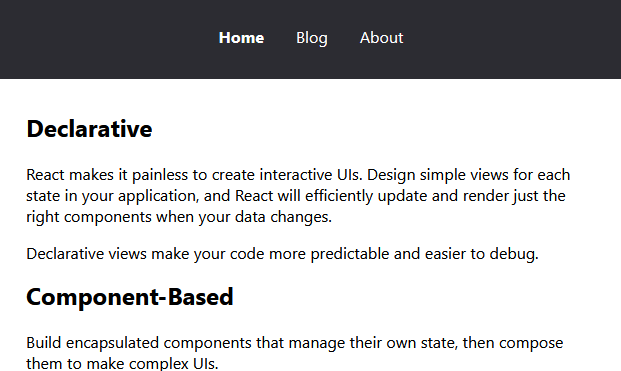

## Code-Splitting

Let's create a simple application with navigation.  
Let's take the source code of the previous lesson as a basis and create a new application based on `react-router-dom`.  
```
npm add react-router-dom
npm add -D @types/react-router-dom
```



For routing to work correctly, you will need to set the `historyApiFallback` option for the devServer section in the [webpack.config.ts](webpack.config.ts).  
To create chunks, we do not need to make any changes to the assembly; webpack automatically creates them for dynamic imports.  
Let's turn to the React [documentation](https://legacy.reactjs.org/docs/code-splitting.html) and use asynchronous pages.  


Let's connect analytics to estimate the size of our pages using the [webpack-bundle-analyzer](https://github.com/webpack-contrib/webpack-bundle-analyzer) plugin.  
It will be automatically shown at the end of the product build.  
```
npm run build:prod
```
Note that the `dist` folder now contains several ds files: the main one and one for each asynchronous page.

[Project source code](./)
