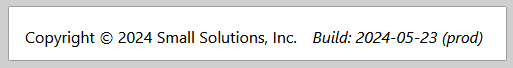

## Build variables

It can be useful to define assembly constants and use them within an application.  
For example, you can pass the date and build type.  

To do this, we use the `DefinePlugin` plugin built into `webpack`.  
Let's make changes to the [webpack.config.ts](webpack.config.ts) file.  
To prevent `typescript` from complaining about new global variables, add them to [global.d.ts](src/global.d.ts).

Let's display these constants in the footer of the application.

[Project source code](./)
